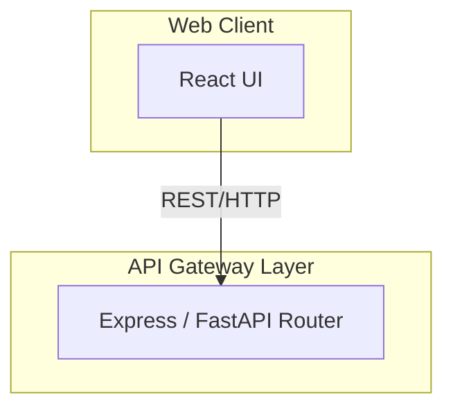
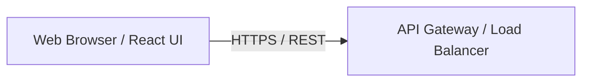

# Frontend Architecture & Requirements

This document consolidates all frontend-related specifications, requirements, and architectural decisions extracted from the `research` documentation for the AryaCrypt project.

## 1. Overview and Goals
*   **Goal:** Provide an enterprise-grade web application for secure file encryption using the novel AryaCrypt algorithm.
*   **Presentation/Interface Layer:** Acts as the primary Web UI for user interactions, file selection, and presenting analytics.

## 2. Tech Stack
*   **Framework:** React.js (Vite)
*   **Language:** TypeScript
*   **Styling:** Tailwind CSS
*   **UI Components:** Shadcn UI

## 3. Core Responsibilities (Functional Requirements)
*   **User Authentication UI:** Interfaces for user registration, secure login, and session management.
*   **File Management:**
    *   File upload and chunking interface leveraging the HTML5 File API.
    *   Interfaces for triggering file encryption and decryption processes.
*   **Dashboards & Analytics:** Dashboard for viewing encryption logs, metrics, and research analytics (audit logging).
*   **Security & Validation:** Client-side validation and secure transmission of data over HTTPS.

## 4. Architectural Integration
*   **Modularity:** The frontend is strictly separated from the API, Cryptography, and Storage layers, ensuring a decoupled architecture.
*   **Communication:** The React UI communicates with the backend Application Layer (Express or FastAPI Router) via RESTful HTTP/HTTPS protocols.
*   **Deployment:** The built application is served to the User Device (Browser) via a Load Balancer / CDN over HTTPS.

## 5. Architectural Diagrams (Frontend Focus)

### Component Flow

### High-Level Enterprise Flow

