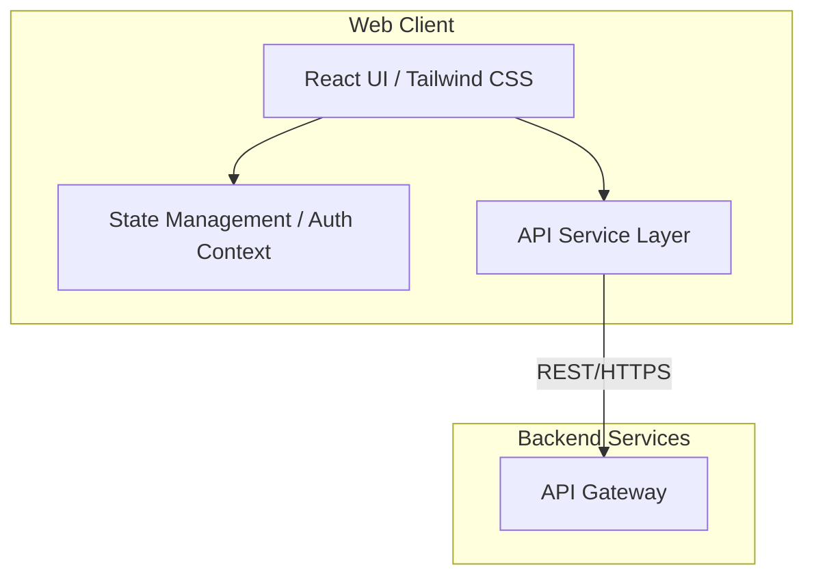
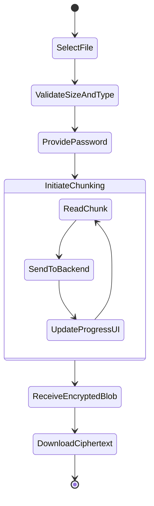

# Frontend System Diagrams

## 1. High-Level Component Flow



## 2. File Upload & Processing Activity



## 3. Deployment Architecture (Frontend)

```mermaid
flowchart TD
    User[User Browser]
    
    subgraph Edge Network
        CDN[Content Delivery Network / Vercel / Cloudflare]
    end
    
    subgraph Backend
        API[Backend Load Balancer]
    end
    
    User -->|Requests Static Assets| CDN
    User -->|API Calls (HTTPS)| API
```
