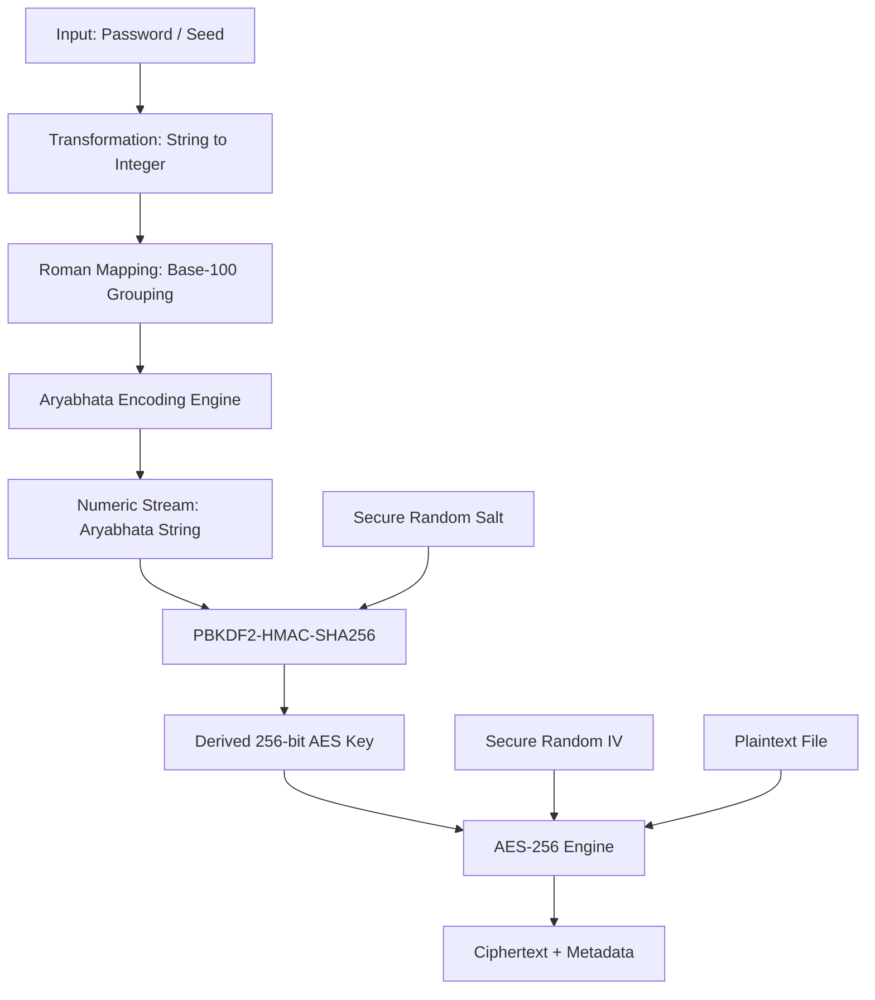
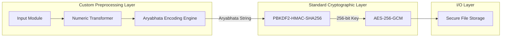
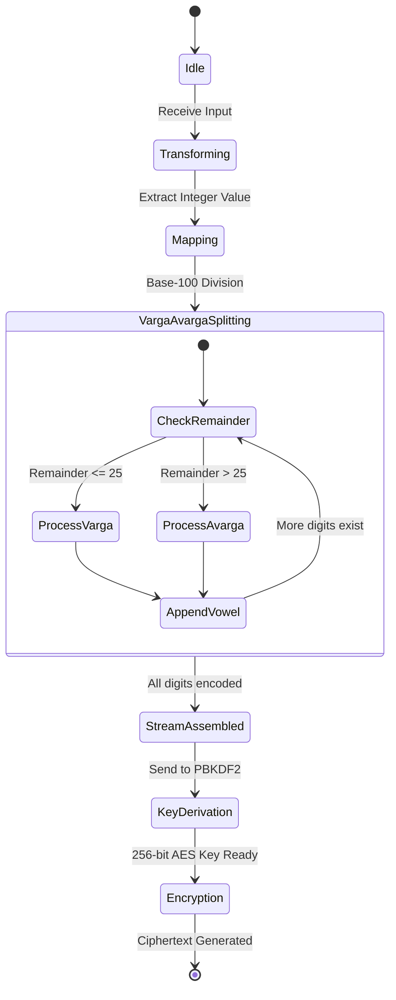
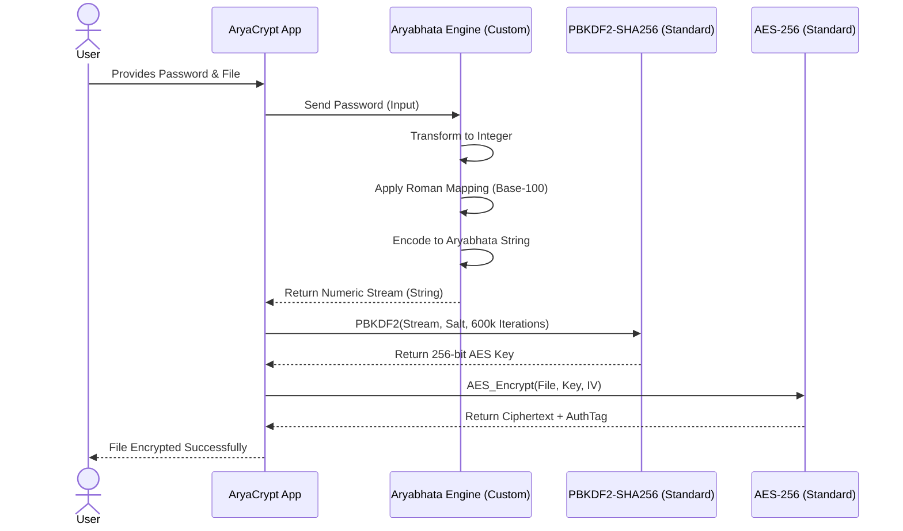

# AryaCrypt Algorithm Design

## 1. Algorithm Pipeline Explanation
The AryaCrypt algorithm introduces a custom mathematical preprocessing layer while strictly preserving the integrity of standard cryptographic primitives (AES-256, PBKDF2, and SHA256). The pipeline functions as follows:

1. **Input:** The algorithm receives a raw input, typically a user password or a high-entropy seed.
2. **Transformation:** The raw input is transformed into a standardized numeric format. For instance, a string is converted into its underlying byte/integer representation to allow for mathematically sound arithmetic operations.
3. **Roman/Positional Mapping:** The large integer is fragmented based on place-value systems (units, tens, hundreds). In the Aryabhata system, numbers are evaluated in base-100, distinguishing between odd places (Varga) and even places (Avarga).
4. **Aryabhata Encoding (Custom Preprocessing):** The mapped positional values are translated into phonetic components based on historical mathematical rules:
   - *Varga* values (1-25) map to specific consonants (k to m).
   - *Avarga* values (30-100) map to other consonants (y to h).
   - Powers of 100 map to vowels (a, i, u, etc.).
5. **Numeric Stream (Encoded Output):** The phonetic components are concatenated to form a highly obscure, deterministic "Aryabhata String". This acts as a high-complexity pre-image.
6. **Key Derivation (Unmodified):** The Aryabhata String is passed as the secret directly into unmodified PBKDF2 (using SHA256 as the underlying hashing algorithm) along with a cryptographic salt. The output is a standard, secure 256-bit (32-byte) key.
7. **AES (Unmodified):** The derived 256-bit key is used in an unmodified AES-256 algorithm (e.g., AES-GCM) for secure file encryption.

---

## 2. Pseudo Code

```text
// 1. Constants based on Aryabhata System
VARGA_CONSONANTS = ['k', 'kh', 'g', 'gh', 'ng', 'c', 'ch', 'j', 'jh', 'ny', 't', 'th', 'd', 'dh', 'n', 't', 'th', 'd', 'dh', 'n', 'p', 'ph', 'b', 'bh', 'm']
AVARGA_CONSONANTS = ['y', 'r', 'l', 'v', 'sh', 'ss', 's', 'h']
VOWEL_MULTIPLIERS = ['a', 'i', 'u', 'r', 'l', 'e', 'o', 'ai', 'au'] // Representing 100^0, 100^1, 100^2, etc.

// 2. Custom Preprocessing: Aryabhata Encoding Engine (AEE)
FUNCTION EncodeAryabhata(numeric_value):
    encoded_string = ""
    power = 0
    
    WHILE numeric_value > 0:
        remainder = numeric_value MOD 100
        numeric_value = numeric_value DIV 100
        
        vowel = VOWEL_MULTIPLIERS[power MOD length(VOWEL_MULTIPLIERS)]
        
        IF remainder > 0 AND remainder <= 25:
            // Varga Processing
            consonant = VARGA_CONSONANTS[remainder - 1]
            encoded_string = consonant + vowel + encoded_string
        ELSE IF remainder > 25:
            // Avarga Processing (Simplified logical mapping)
            tens = (remainder DIV 10) * 10
            units = remainder MOD 10
            
            IF tens >= 30:
                avarga_index = (tens - 30) DIV 10
                consonant = AVARGA_CONSONANTS[avarga_index]
                encoded_string = consonant + vowel + encoded_string
            
            IF units > 0:
                consonant_unit = VARGA_CONSONANTS[units - 1]
                encoded_string = consonant_unit + vowel + encoded_string
        
        power = power + 1
        
    RETURN encoded_string

// 3. Main Workflow
FUNCTION AryaCryptMain(password, file_data):
    // Step 1 & 2: Input & Transformation
    numeric_seed = ConvertToInteger(password)
    
    // Step 3 & 4: Roman Mapping & Aryabhata Encoding
    aryabhata_stream = EncodeAryabhata(numeric_seed)
    
    // Step 5 & 6: Key Derivation (Standard PBKDF2-HMAC-SHA256)
    salt = GenerateSecureRandomSalt(16)
    iterations = 600000
    key_length = 32 // 256 bits
    
    aes_key = PBKDF2_SHA256(secret=aryabhata_stream, salt=salt, iterations=iterations, dkLen=key_length)
    
    // Step 7: AES Encryption (Standard AES-256-GCM)
    iv = GenerateSecureRandomIV(12)
    ciphertext, auth_tag = AES_GCM_256_Encrypt(key=aes_key, iv=iv, plaintext=file_data)
    
    RETURN (salt, iv, auth_tag, ciphertext)
```

---

## 3. Flowchart


---

## 4. Architecture Diagram


---

## 5. State Diagram


---

## 6. Sequence Diagram

