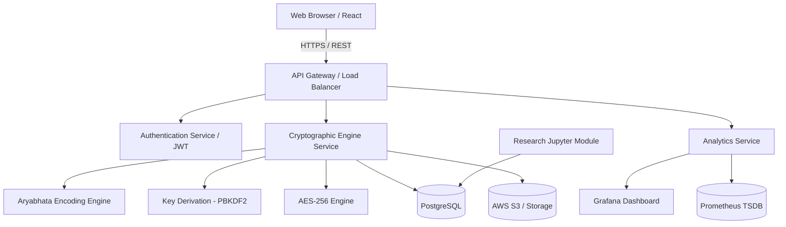

# Enterprise Software Architecture: AryaCrypt

## 1. High-Level Architecture
AryaCrypt follows a **Modular Monolith transitioning to Microservices** architecture, designed for enterprise scalability, security, and research analytics.

## 2. Architectural Components

### 2.1 Frontend (Presentation Layer)
*   **Tech Stack:** React.js (Vite), TypeScript, Tailwind CSS, Shadcn UI.
*   **Responsibilities:**
    *   User Authentication UI.
    *   File upload and chunking interface (HTML5 File API).
    *   Dashboard for viewing encryption logs and analytics.
    *   Client-side validation and secure transmission (HTTPS).

### 2.2 Backend (Application Layer)
*   **Tech Stack:** Node.js (Express) OR Python (FastAPI). *Python is recommended for the Research Module due to extensive crypto/math libraries.*
*   **Responsibilities:**
    *   RESTful API Gateway.
    *   Authentication & Session Management.
    *   **Cryptographic Core Service:** Implements the AryaCrypt Preprocessing Engine, PBKDF2 integration, and AES-256-GCM logic.
    *   File streaming to storage.

### 2.3 Framework (Design Patterns)
*   **Dependency Injection:** To decouple the Aryabhata Engine from the AES Engine.
*   **Stream Processing:** For handling multi-gigabyte files without crashing server RAM.
*   **Event-Driven Logging:** Asynchronous logging of encryption metrics for analytics.

### 2.4 Database (Persistence Layer)
*   **Tech Stack:** PostgreSQL (Relational Data), Redis (Caching/Sessions).
*   **Responsibilities:**
    *   ACID-compliant storage of user data, file metadata, and cryptographic metadata (Salts, IVs).
    *   *Note: Encryption Keys are NEVER stored.*

### 2.5 Storage (Blob Layer)
*   **Tech Stack:** AWS S3, MinIO (Local Object Storage), or local Block Storage.
*   **Responsibilities:**
    *   Storing the actual encrypted ciphertext files.
    *   Providing secure, signed URLs for file retrieval.

### 2.6 Authentication (Identity Layer)
*   **Tech Stack:** JSON Web Tokens (JWT), OAuth2 (optional via Auth0).
*   **Responsibilities:**
    *   Role-Based Access Control (Admin, Researcher, User).
    *   Secure stateless API access.

### 2.7 Analytics (Observability Layer)
*   **Tech Stack:** Prometheus & Grafana OR Elasticsearch & Kibana (ELK).
*   **Responsibilities:**
    *   Tracking encryption latency, throughput, and system resource utilization.
    *   Monitoring API response times and error rates.

### 2.8 Research Module (Validation Layer)
*   **Tech Stack:** Python (Jupyter, Pandas, NumPy, SciPy).
*   **Responsibilities:**
    *   Validating the Avalanche Effect of the Aryabhata strings.
    *   Conducting NIST Statistical Test Suite for randomness on generated keys.
    *   Generating graphs for research publications.

## 3. Enterprise Architecture Diagram

