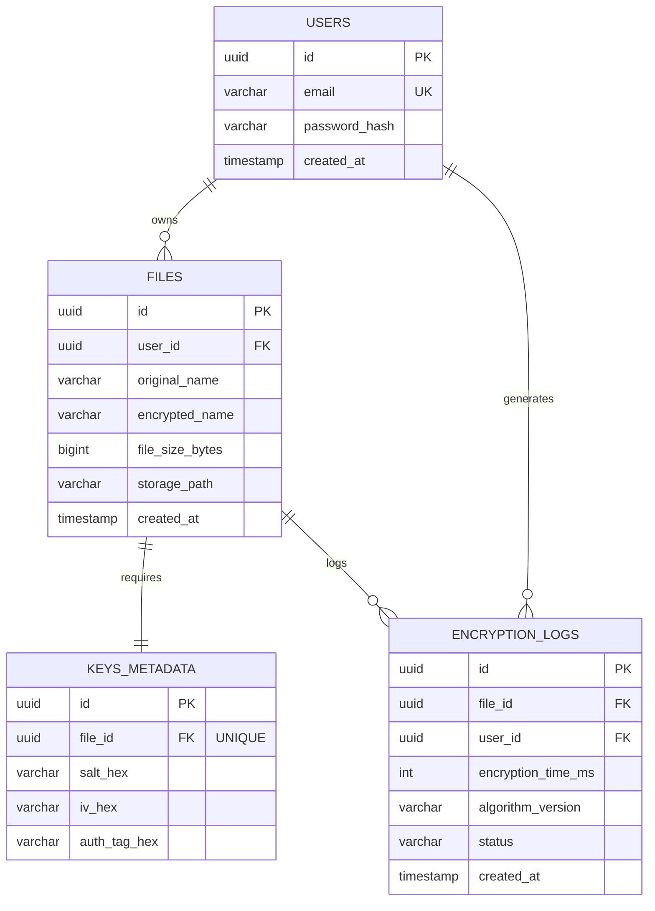

# Database Design (PostgreSQL)

## 1. Entity-Relationship (ER) Diagram

## 2. Table Definitions & Normalization (3NF)

### 2.1 Table: `users`
*   **Primary Key:** `id` (UUID)
*   **Columns:** 
    *   `email` (VARCHAR, UNIQUE, NOT NULL)
    *   `password_hash` (VARCHAR, NOT NULL) - *For login, not file encryption*
    *   `created_at` (TIMESTAMP, DEFAULT NOW)
*   **Indexes:** B-Tree on `email`

### 2.2 Table: `files`
*   **Primary Key:** `id` (UUID)
*   **Foreign Key:** `user_id` -> `users.id` (ON DELETE CASCADE)
*   **Columns:**
    *   `original_name` (VARCHAR, NOT NULL)
    *   `encrypted_name` (VARCHAR, NOT NULL)
    *   `file_size_bytes` (BIGINT, NOT NULL)
    *   `storage_path` (VARCHAR, NOT NULL)
*   **Indexes:** B-Tree on `user_id`

### 2.3 Table: `keys_metadata`
*   **Primary Key:** `id` (UUID)
*   **Foreign Key:** `file_id` -> `files.id` (ON DELETE CASCADE, UNIQUE)
*   **Columns:**
    *   `salt_hex` (VARCHAR(64), NOT NULL) - *Used for PBKDF2*
    *   `iv_hex` (VARCHAR(32), NOT NULL) - *Used for AES-GCM*
    *   `auth_tag_hex` (VARCHAR(32), NOT NULL) - *Used for AES-GCM Integrity*
*   **Security Note:** Keys are derived on-the-fly and NEVER stored.

### 2.4 Table: `encryption_logs`
*   **Primary Key:** `id` (UUID)
*   **Foreign Keys:** `file_id` -> `files.id`, `user_id` -> `users.id`
*   **Columns:**
    *   `encryption_time_ms` (INT, NOT NULL)
    *   `algorithm_version` (VARCHAR, DEFAULT 'AryaCrypt-v1')
    *   `status` (VARCHAR, 'SUCCESS' | 'FAILED')
*   **Indexes:** B-Tree on `created_at` for time-series queries.

## 3. Relationships & Normalization
*   **1-to-Many:** A User can have multiple Files and Logs.
*   **1-to-1:** A File has exactly one Key Metadata record.
*   **3NF Compliance:** No transitive dependencies. All attributes depend strictly on the primary key of their respective tables. Metadata is decoupled from the `files` table to maintain separation of cryptographic material from general file data.
