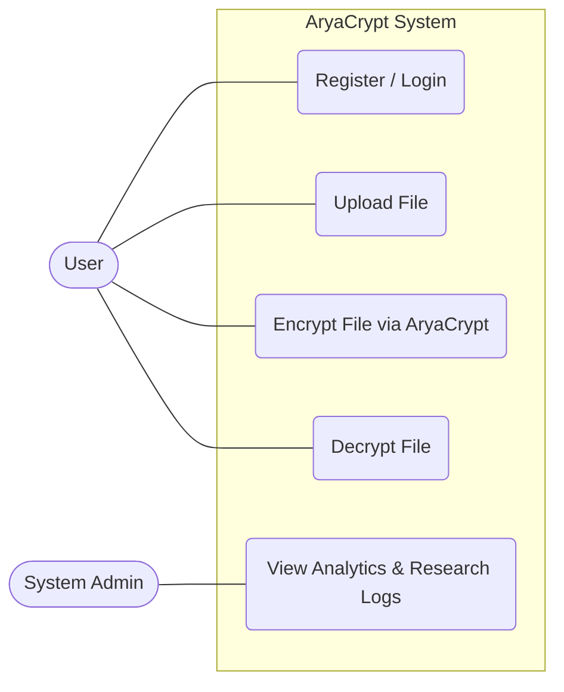
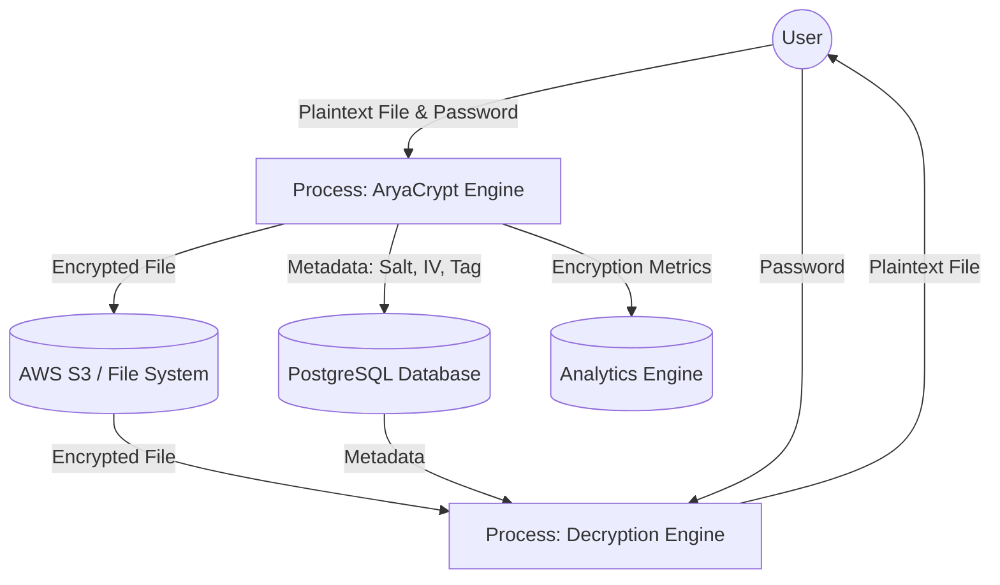
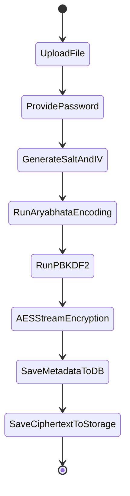
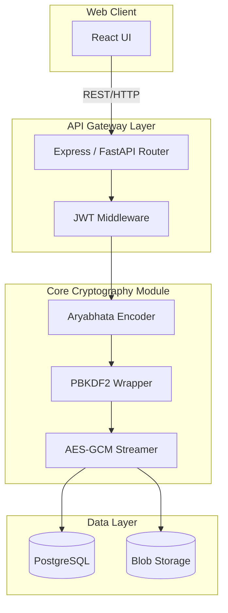

# System Design Diagrams (UML & Structural)

## 1. Software Requirements Specification (SRS) Summary
*   **Goal:** Provide an enterprise-grade web application for secure file encryption using the novel AryaCrypt algorithm.
*   **Functional Requirements:** User registration, secure login, file upload, file encryption, file decryption, metadata management, audit logging.
*   **Non-Functional Requirements:** High availability, stream-based I/O for large files (O(1) memory footprint), cryptographic latency < 2s for operations excluding actual encryption I/O.

## 2. Software Design Document (SDD) Summary
*   **Modularity:** Strict separation of UI, API, Cryptography, and Storage layers.
*   **Security:** Enforced HTTPS, PBKDF2 for password hashing, AES-256-GCM for files, stateless JWT authentication.

## 3. Use Case Diagram


## 4. Data Flow Diagram (DFD - Level 1)


## 5. Activity Diagram (Encryption Process)


## 6. Component Diagram


## 7. Deployment Diagram
```mermaid
flowchart TD
    node1[User Device - Browser]
    
    subgraph Cloud Environment (e.g., AWS / Vercel + Railway)
        node2[Load Balancer / CDN]
        
        subgraph App Servers
            node3[Node.js / Python Backend Container]
        end
        
        subgraph Database Servers
            node4[(Managed PostgreSQL)]
        end
        
        subgraph Storage Servers
            node5[(S3 Object Storage)]
        end
    end

    node1 -->|HTTPS| node2
    node2 --> node3
    node3 -->|TCP/IP| node4
    node3 -->|HTTPS| node5
```
